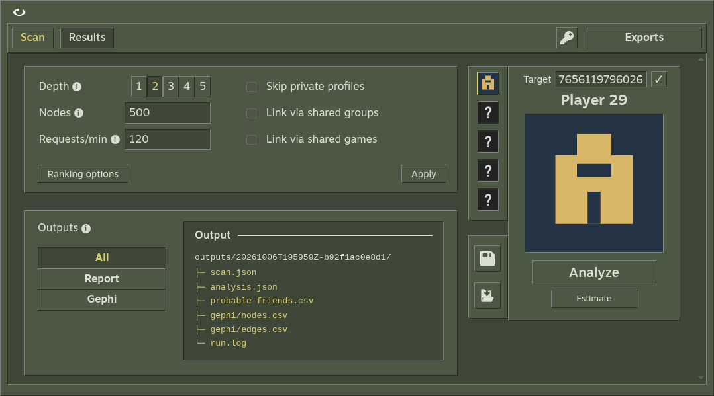
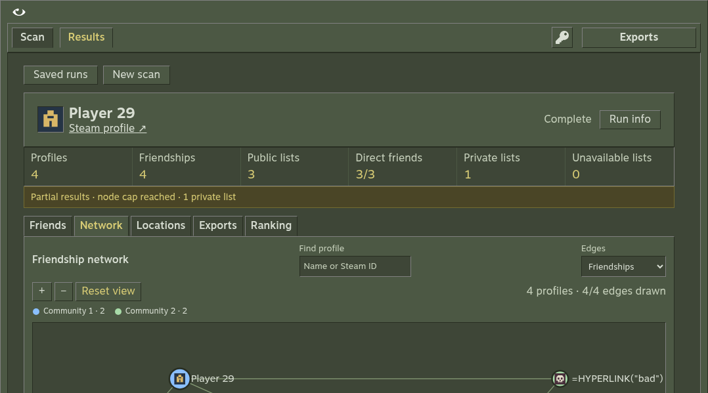

<p align="center">
  <a href="https://github.com/Microck/vapora">
    
  </a>
</p>

<p align="center">an OSINT tool for exploring public Steam friend networks.</p>

<p align="center">
  <a href="LICENSE"></a>
  <a href="https://github.com/Microck/vapora/stargazers"></a>
  <a href="https://github.com/Microck/vapora/issues"></a>
</p>

---

## tl;dr

map a Steam user's friend network, find communities and hubs, and export Gephi-ready CSVs plus a probable-friends report.

- [download Vapora](https://github.com/Microck/vapora/releases/latest). Windows has an installer and a portable EXE; Linux has an AppImage; macOS has a DMG.
- get a [Steam API key](https://steamcommunity.com/dev/apikey).
- open the app, paste your key using the key button, then enter a Steam profile URL or ID.
- choose your depth and node cap, then **Analyze**. Start with the defaults: depth 2, 500 accounts.
- inspect **Results**, or open the output folder and import the CSVs into Gephi.



---

## features

- classic Steam UI, with profile pictures, saved runs and a browser version.
- Steam IDs, profile URLs and vanity names.
- depth 1-5, a hard node cap, request pacing and retries.
- estimate before scanning; cancel and resume without starting over.
- an explicit **Skip private profiles** checkbox, with missing data shown in the report.
- communities, degree, betweenness and hubs; searchable graphs and profile inspection.
- probable-friend rankings from mutuals, Jaccard, shared groups and shared games.
- saved settings, offline reranking, local SteamHistory imports and Gephi-ready exports.



Screenshots use local fixture profiles. Rankings and location signals are heuristics, not proof of real-life relationships or residence. Vapora uses the Steam Web API and does not bypass privacy.

---

## installation

### desktop

No Node.js or Python installation needed. Get the file for your system from the [latest release](https://github.com/Microck/vapora/releases/latest):

| System | Download | Open it |
| --- | --- | --- |
| Windows x64 | [installer](https://github.com/Microck/vapora/releases/download/2.0.3/vapora-2.0.3-win-x64.exe) | run the installer |
| Windows x64 | [portable EXE](https://github.com/Microck/vapora/releases/download/2.0.3/vapora-2.0.3-win-x64-portable.exe) | run it from a writable folder |
| Linux x64 | [AppImage](https://github.com/Microck/vapora/releases/download/2.0.3/vapora-2.0.3-linux-x86_64.AppImage) | make executable, then open |
| macOS Apple Silicon | [DMG](https://github.com/Microck/vapora/releases/download/2.0.3/vapora-2.0.3-mac-arm64.dmg) | drag Vapora into Applications |

Portable runs and settings live in `Vapora-data` beside the EXE. Move both together. Installed-app data lives in the OS app-data directory under `Vapora`. Enter your API key for each app session; it is not saved in reports.

Downloads are unsigned and not notarized. Check the release's `SHA256SUMS.txt` before approving an OS warning. Linux without FUSE can use `--appimage-extract-and-run`.

### browser / CLI / from source

Install [Node.js 24+](https://nodejs.org/), then:

```sh
git clone https://github.com/Microck/vapora.git
cd vapora
npm ci
npm run build
npm start -- serve
```

Open the printed local address. For a desktop window from source, use `npm run desktop`. For the CLI, set `STEAM_API_KEY` in `.env` or your environment:

```sh
npm start -- scan 'https://steamcommunity.com/id/example' --preset inner
npm start -- recent
npm start -- resume RUN_ID
```

See the [usage guide](docs/usage.md) for commands, settings, data locations and troubleshooting.

---

## how it works

1. resolve the target through Steam, then walk public friendships breadth first.
2. save a checkpoint after each completed scan unit, so interrupted runs can resume.
3. build the friendship graph and calculate communities, centrality and ranking signals.
4. write reports and CSVs to a unique run folder.

```text
outputs/<run-id>/
├─ scan.json
├─ analysis.json
├─ probable-friends.csv
├─ run.log
└─ gephi/
   ├─ nodes.csv
   └─ edges.csv
```

Attached history also adds `history.json`. Missing observations and node-cap limits stay visible in the report.

### gephi how-to

1. import `gephi/nodes.csv` as a nodes table.
2. import `gephi/edges.csv` as undirected edges.
3. filter `Kind` to `friend`; inspect `group` links separately.
4. run ForceAtlas2, color by `modularity_class`, and size by `betweenness` or `degree`.

[CSV columns, ranking details and history imports](docs/usage.md#reports-and-exports).

---

## development

```sh
npm run verify
VAPORA_BROWSER=/path/to/chrome npm run test:e2e
npm run package
```

[Core CI](https://github.com/Microck/vapora/actions/workflows/ci.yml) checks Linux, Windows and macOS. [Desktop CI](https://github.com/Microck/vapora/actions/workflows/desktop.yml) launches the packaged downloads before release. See the [product contract](docs/product-contract.md), [verification report](docs/e2e-verification.md) and [release runbook](docs/release-runbook.md).

This is the TypeScript + Effect app. The original Python implementation stays on [legacy](https://github.com/Microck/vapora/tree/legacy), with its [1.0.2 release](https://github.com/Microck/vapora/releases/tag/1.0.2).

---

## license

mit © microck. See [LICENSE](LICENSE).
