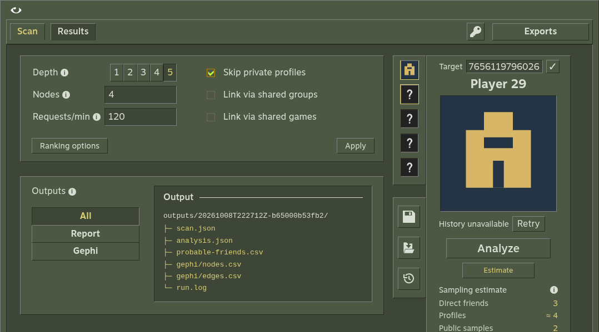
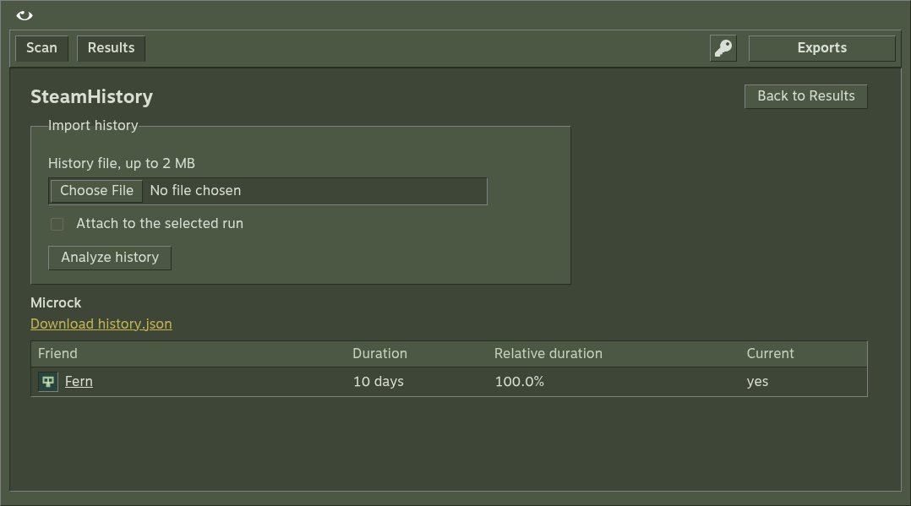

<p align="center">
  <a href="https://github.com/Microck/vapora"></a>
</p>

<p align="center">
  <a href="https://github.com/Microck/vapora/releases"></a>
  <a href="https://github.com/Microck/vapora/actions/workflows/ci.yml"></a>
  <a href="LICENSE"></a>
</p>

---

`vapora` is a local app for exploring public Steam friend networks. scan an account, inspect communities and hubs, compare the observations behind friend rankings, browse dated SteamHistory captures, and export JSON or Gephi-ready CSVs. use the desktop app, a local browser, or the CLI — all three share the same scanner and saved runs.

the main setup path is a [desktop download](https://github.com/Microck/vapora/releases/latest) and a [Steam API key](https://steamcommunity.com/dev/apikey). start with a small scan, read its coverage, then expand when you need more context.

[documentation](website/content/docs/index.mdx) | [downloads](https://github.com/Microck/vapora/releases/latest) | [CLI reference](website/content/docs/reference/cli.mdx)


## why

- explore public friendships through searchable graphs, community colors and profile inspectors
- keep private, skipped and unavailable observations visible instead of treating them as empty
- estimate before collecting; cancel and resume from a saved checkpoint
- rerank completed runs and rebuild exports offline
- inspect names, avatars, friendship periods and comments in dated history captures
- keep runs local and take the underlying data into Gephi or other tools

rankings and location signals are heuristics. they do not prove real-life friendship or residence. Vapora uses public Steam API observations and does not bypass privacy. screenshots use fixture profiles.

## quickstart

### desktop

get the matching file from the [latest release](https://github.com/Microck/vapora/releases/latest):

| system | download | launch |
| --- | --- | --- |
| Windows x64 | installer EXE | run the installer |
| Windows x64 | portable EXE | run from a writable folder |
| Linux x64 | AppImage | make executable, then open |
| macOS Apple Silicon | DMG | drag into Applications |

no Node.js or Python installation is needed for desktop downloads. packages include the history runtime. downloads are unsigned and not notarized; compare the file with the release's `SHA256SUMS.txt` before approving an OS warning. Linux without FUSE can use `--appimage-extract-and-run`.

1. open Vapora and use the key button to set your Steam API key.
2. enter a Steam profile URL or SteamID64; use the check button to verify it.
3. choose depth and node cap. defaults are depth 2, 500 accounts and 120 requests/min; try depth 1 and 100 accounts for a first run.
4. select Estimate, then Analyze.
5. open Results to inspect coverage, rankings and Network. use Exports to keep the files.



[first-scan tutorial](website/content/docs/getting-started/first-scan.mdx) · [installation details](website/content/docs/getting-started/installation.mdx)

### browser / from source

install Node.js 24+ and Python 3.10+ for the one-time history runtime build:

```sh
git clone https://github.com/Microck/vapora.git
cd vapora
npm ci
npm run build
npm run build:history
npm start -- serve
```

open the printed local address, normally `http://127.0.0.1:3000`. use `npm run desktop` for an Electron window. Linux needs a graphical desktop and GTK/NSS libraries. Windows source launches may need the matching Visual C++ runtime; see the [installation guide](website/content/docs/getting-started/installation.mdx).

### api key

get your key from [Steam](https://steamcommunity.com/dev/apikey). the toolbar accepts a session key in desktop or browser mode. desktop can remember it with OS-backed encryption when available; browser keys are session-only. keys never appear in reports or exports.

for the CLI, set `STEAM_API_KEY` in the environment or copy `.env.example` to `.env` and fill it in:

```sh
export STEAM_API_KEY='YOUR_KEY'
npm start -- scan 'https://steamcommunity.com/id/example' --preset inner
```

```powershell
$env:STEAM_API_KEY = 'YOUR_KEY'
npm start -- scan 'https://steamcommunity.com/id/example' --preset inner
```

replace the illustrative target with your account. [credential storage and precedence](website/content/docs/getting-started/api-key.mdx).

## command surface

commands run through `npm start --` from a built source checkout.

| command | purpose |
| --- | --- |
| `serve` | open the local browser UI; default command |
| `scan TARGET` | collect a new network and write exports |
| `estimate TARGET` | sample public lists without saving a run |
| `resume RUN_ID` | continue a saved checkpoint |
| `analyze RUN_ID` | rebuild reports from saved observations |
| `recent` | list saved runs |
| `profiles` | list saved configuration profiles |
| `profile-save NAME` | save settings for another scan |
| `history FILE [--run RUN_ID]` | import history independently or attach it to a matching run |

```sh
npm start -- estimate 'https://steamcommunity.com/id/example' --depth 2
npm start -- profile-save small --depth 1 --max-nodes 100
npm start -- scan 'https://steamcommunity.com/id/example' --profile small
npm start -- recent
npm start -- resume RUN_ID
npm start -- analyze RUN_ID
npm start -- history profile.json --run RUN_ID
npm start -- serve --port 3001 --root ./research
npm start -- --help
```

replace `RUN_ID` with the exact saved ID. CLI scan, estimate and resume require a Steam key. history imports, profiles and report rebuilding work without one. [full CLI reference](website/content/docs/reference/cli.mdx).

## collection and analysis

| control | default | behavior |
| --- | --- | --- |
| depth | 2 | 1–5; depth 1 admits target and direct friends |
| node cap | 500 | includes the target; 0 removes the cap |
| requests/min | 120 | 0 removes pacing; retries still back off |
| skip private profiles | off | retain known accounts and incoming links; skip their observations |
| groups / games | off | optional public overlap observations |
| ranking weights | mutual 1; other weights 0 | authored incoming-mutual index by default |
| Top N / count baseline | 5 / 50 | reference controls for count indices |
| location support / baseline | product / 100 | self-reported country/city evidence |

estimates sample at most five lists. depths 3–5 estimate the first two levels, not the entire network. graph metrics use admitted accounts; rankings can retain direct friends outside the cap. a private list differs from an empty public list.

completed runs can change weights through Ranking → Save ranking without Steam requests. Exports → Rebuild exports regenerates files offline. missing signals remain unknown, and all-zero ranking weights produce no combined index.

[settings and ranges](website/content/docs/reference/settings.mdx) · [formulas and populations](website/content/docs/reference/scoring.mdx) · [coverage limits](website/content/docs/explanation/privacy.mdx)

## history

verifying an account or selecting a recent avatar can load SteamHistory independently. saved captures are reused until Refresh; failed or blocked requests preserve the last dated capture and do not stop Steam scans.

the viewer supports friendship periods, persona and real names, URLs, avatars, profile metadata and comments. imports accept JSON, NDJSON and provider data streams, preserving original inputs and distinct captures. comment ranking is separate from network ranking. partial provider coverage stays explicit.



[history guide](website/content/docs/guides/history.mdx) · [formats and date rules](website/content/docs/reference/history-format.mdx)

## exports and local data

| file in `outputs/<run-id>/` | contents |
| --- | --- |
| `scan.json` | settings, observations and resume frontier |
| `analysis.json` | metrics, rankings and coverage |
| `probable-friends.csv` | candidate signals and scores |
| `gephi/nodes.csv` | profile nodes and graph metrics |
| `gephi/edges.csv` | friendship and optional group edges |
| `run.log` | timestamped progress and diagnostics |
| `history.json` | attached history, when available |

browser and CLI use the working directory, or `--root DIRECTORY`. installed desktop uses the OS app-data directory under `Vapora`; Windows portable uses `Vapora-data` beside its EXE. move both together. `VAPORA_ROOT` overrides the desktop location. remembered keys are bound to their original OS account and machine.

for Gephi, import nodes first, then undirected edges. filter `Kind` to `friend`, run ForceAtlas2, color by `modularity_class`, and size by `betweenness` or `degree`. inspect group links separately. keep SteamID64 columns as text in spreadsheets.

[export reference](website/content/docs/reference/exports.mdx) · [Gephi workflow](website/content/docs/guides/gephi.mdx) · [saved runs](website/content/docs/guides/saved-runs.mdx)

## documentation

full Fumadocs source lives in [`website/`](website). it includes a Steam-inspired dark theme, local search, responsive navigation, setup tutorials, task guides, source-verified references and explanations.

```sh
cd website
npm ci
npm run dev
npm run verify
```

`npm run build` exports the site to `website/out/`. it can be served by a static host without Steam credentials. [maintenance and hosting](website/content/docs/project/documentation.mdx).

- [installation](website/content/docs/getting-started/installation.mdx)
- [first scan](website/content/docs/getting-started/first-scan.mdx)
- [network exploration](website/content/docs/guides/network.mdx)
- [reranking](website/content/docs/guides/ranking.mdx)
- [troubleshooting](website/content/docs/guides/troubleshooting.mdx)

## development

```sh
npm ci
npm run verify
VAPORA_BROWSER=/path/to/chrome npm run test:e2e
npm run package
```

core CI checks Linux, Windows and macOS. desktop CI launches packaged downloads before release. docs have a separate locked build and link check. see the [development guide](website/content/docs/project/development.mdx), [product contract](docs/product-contract.md) and [release runbook](docs/release-runbook.md).

this is the TypeScript + Effect app. the original Python implementation remains on [legacy](https://github.com/Microck/vapora/tree/legacy), with [release 1.0.2](https://github.com/Microck/vapora/releases/tag/1.0.2). earlier local formats are not automatically migrated.

## contributing

open an [issue](https://github.com/Microck/vapora/issues) or pull request with reproducible steps, version and relevant redacted diagnostics. keep API keys and `.env` files out of reports.

## disclaimer

this project is unofficial and not affiliated with or endorsed by Valve, Steam or SteamHistory. public observations and historical captures can be incomplete; the app keeps those limits visible.

## license

mit © microck. see [LICENSE](LICENSE).
