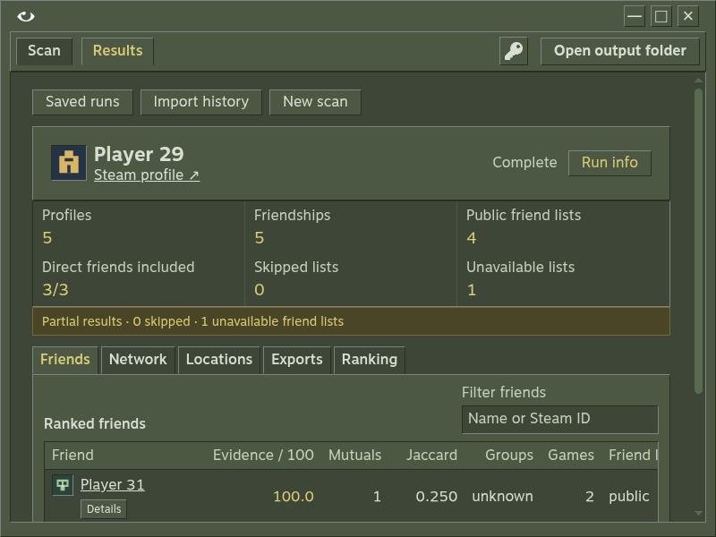
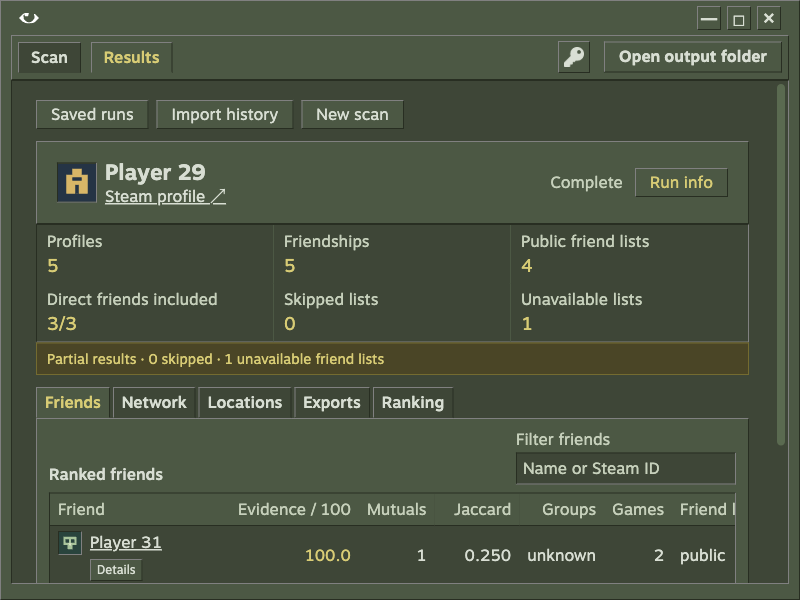

# Current E2E verification

Checked on 2026-10-06 against the current TypeScript app and shared browser/Electron UI. Each fixture workflow uses a fresh data directory and an actual local HTTP provider, not mocked modules or transports. The older archive and historical SteamHistory samples are outside this verification.

## Results

| Workflow | Evidence | Result |
| --- | --- | --- |
| Authenticated live Steam collection | Authorized Microck profile, depth 1, five-account cap, groups/games enabled, private-skip policy enabled | Complete; five names/avatars and public friend lists, groups public, four game observations public and one private; partial coverage correctly disclosed; six nonempty exports |
| Live browser results | A second bounded scan started from the actual browser Analyze control against Steam; completion/checkpoint/report, real profile images and six exports checked; reopened after server restart | Passed with five accounts and five avatars, correct partial coverage and no renderer errors |
| CLI | Current live scan copied into isolated storage: recent, analyze, completed resume, profile save/list, standalone/attached fresh normalized history; authenticated depth-1 estimate | Passed; offline commands preserve saved observations; estimate queries only the target |
| Key handling and target inputs | Missing key, invalid form value, denied provider key twice, replacement key, six target formats, invalid profile host | Passed; failures visible and attempts distinct; key field clears after saving |
| Collection settings | Depth 5, skip checkbox, groups/games, ranking dialog and Enter, Apply/reload, named profile save/load, All/Report/Gephi | Passed; file filters do not change collection settings |
| Cancel, restart and resume | Held second-account request, cancel from Settings, restart server with no session key, reopen saved run, restore key and resume | Passed; completed seed friend list is not fetched again |
| Analysis navigation | Friends search and empty recovery, profile inspector, graph selection/search, zoom/reset and edge filters, locations | Passed |
| Offline ranking | Save ranking, compare provider request count, reload and inspect persisted weight | Passed with zero provider requests |
| History and downloads | Fresh JSON/NDJSON, invalid/oversize inputs, no selected run, wrong account, correct attachment/reopening; real browser clicks and saved files | Passed; seven links after attachment; analysis JSON, Gephi CSV and history JSON actually downloaded and parsed |
| Run management | Search/status filters, Run info Escape, valid current run beside a damaged current checkpoint | Passed; damaged checkpoint is reported and healthy runs remain usable |
| Private and provider failures | Private target estimate/scan, two 429 responses then success, exhausted 503 retries then resume, malformed summaries then recovered lookup | Passed; private target makes no friend-list requests when skipped; 429 makes exactly three target attempts; failures remain visible |
| Responsive layout | Scan, Results, History and Settings at 320, 390, 560, 720, 940, 1078 and 1280px | No page-level horizontal overflow or browser JavaScript errors; wide tables retain their own scroll area |
| Linux desktop | Real Electron window under Xvfb with a window manager, fresh storage, fixture HTTP provider | All nine native workflow groups passed |
| macOS desktop | Disposable Apple Silicon VM, real Electron window, fresh storage, fixture HTTP provider | All nine native workflow groups passed |
| Windows desktop | Disposable Windows 10 ARM64 QEMU VM | Not verified: Electron extraction failed before app startup; the clean VM lacked its required Visual C++ runtime |

The nine native groups cover isolated launch, lookup/avatar, active-scan close with a cancelled resumable checkpoint, restart/default persistence/resume without repeating the seed, graph and six exports, actual maximize/restore, output-folder IPC for root/selected run, actual minimize/restore and clean close with exit code 0. Native window state was checked in Electron's main process. macOS screenshots reflect the VM's 800px desktop; the window adapts to that screen.

## Defect found and fixed

A failed scan can leave a saved checkpoint without a player summary. After replacing the denied key and explicitly looking up the same account, the endpoint returned the correct identity, but the Target panel kept the saved checkpoint's placeholder name and avatar.

Reproduction:

1. Start with a syntactically valid key that the provider rejects.
2. Scan a numeric Steam account ID and wait for the failed run.
3. Replace the key with an accepted key.
4. Return to Scan and explicitly look up that same ID.

The successful lookup must display the fresh name and loaded avatar. `renderTarget` now gives that explicit lookup precedence over the matching saved checkpoint. This contract is recorded in `product-contract.md`; the repeatable browser E2E suite covers it along with cancellation/resume, persistence, ranking, history and actual downloads.

The final PR review also found that the browser toolbar's Exports button gave no feedback without a selected run. It now prompts the operator to open a saved run and retains the current screen. With a selected run, it closes the run library and shows downloads. The browser suite reproduced the missing notice before the fix and checks both states.

## Repeatable checks

```sh
npm ci
npm run verify
VAPORA_BROWSER=/path/to/chrome npm run test:e2e
```

Types, Oxlint, build and all 15 existing domain/integration tests passed. The real-browser E2E test also passed. Linux CI runs that browser suite using installed Google Chrome. CI verifies the core on Linux, Windows and macOS; its core jobs alone do not verify native window behavior.

The expanded interactive browser pass covered 11 main workflow groups and four private/provider-error groups. Test-driver issues were corrected separately: downloads needed the active browser context and the server's actual attachment filename; corruption must use a valid run-directory ID; native window assertions must target the current process inspector. These were harness corrections, not product fixes.

The simplification review applied three test-harness improvements: standard timer reuse, cleanup registered during setup with all shutdowns attempted, and retrying only missing download files while surfacing other filesystem errors. It found no further product changes or now-unreachable app code.

## Inspected captures

These are captures of the running current app with fresh fixture identities, opened and visually checked. They do not contain the Steam API key or copied historical data.






## Windows test-environment limit

The Windows 10 ARM64 VM ran Node 24.13.0 and completed the locked dependency install, typecheck and lint. Native startup did not reach Vapora: Electron downloads its binary on first use, and its bundled ZIP extractor failed with `ERR_DLOPEN_FAILED`. The ARM64 extractor binary exists and links `VCRUNTIME140.dll`; that DLL was absent from the VM. The generic loader message mentions optional dependencies, but this package bundles its native binaries and does not use the suggested optional package. The lockfile was not changed to accommodate that misleading message.

Microsoft runtime installation did not complete in the test VM. The local installer bytes matched the SHA-256 in Microsoft's download URL. The probe was ended and the owned VM released; this is an unverified native platform, not a desktop pass. The Windows 11 test VM could not be allocated because the Hyper-V host lacked free memory. Windows core CI passed on the current PR, which does not establish a native desktop launch. A working Windows desktop with the required runtime is needed to finish that platform check.

## Limits

The live run intentionally admitted five accounts at depth 1. Deeper frontiers, private accounts and transient provider failures were checked through executable HTTP fixtures, not large live networks. No iOS Safari session, physical screen-reader session, packaged desktop installer or native Windows app has been verified in this pass. Steam can still return private or unavailable observations; the app must disclose those states rather than imply full coverage.

Export files are replaced individually, not as a multi-file transaction. A disk or permission failure while saving a ranking can leave partially regenerated exports beside the previous checkpoint; the error is visible. Fix the storage problem, then run `npm start -- analyze RUN_ID --root DATA_DIRECTORY` to regenerate exports from the canonical checkpoint. This limit also applies to the existing export workflow.
