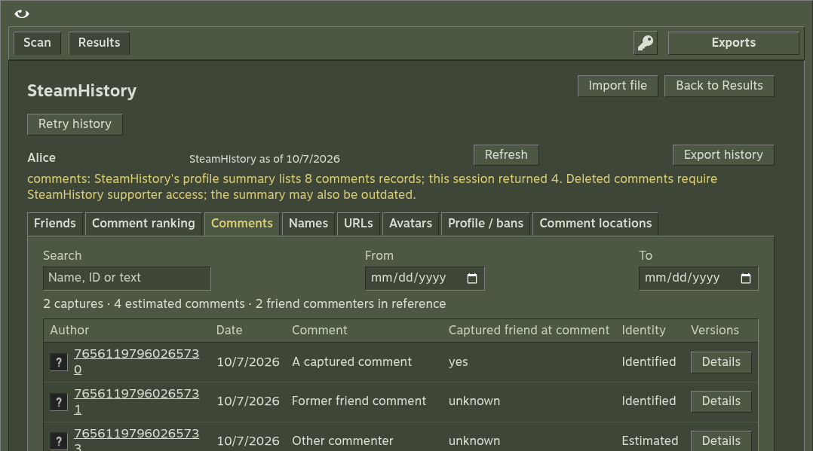
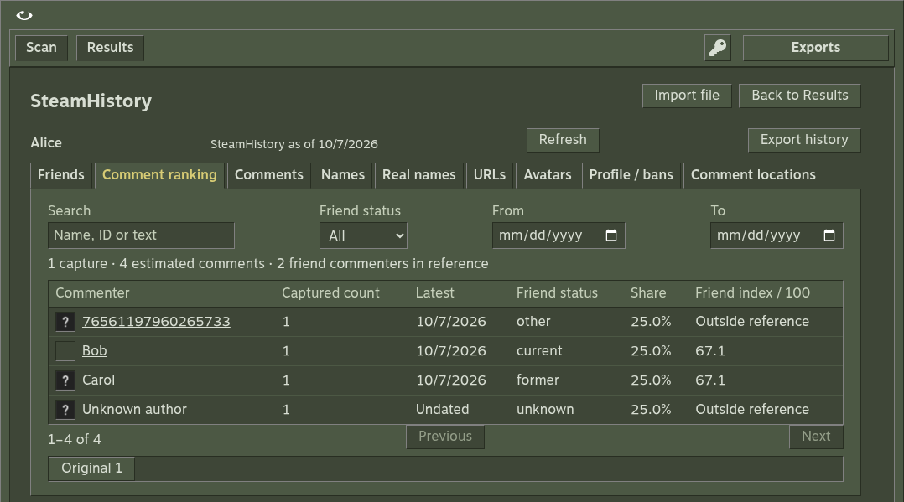
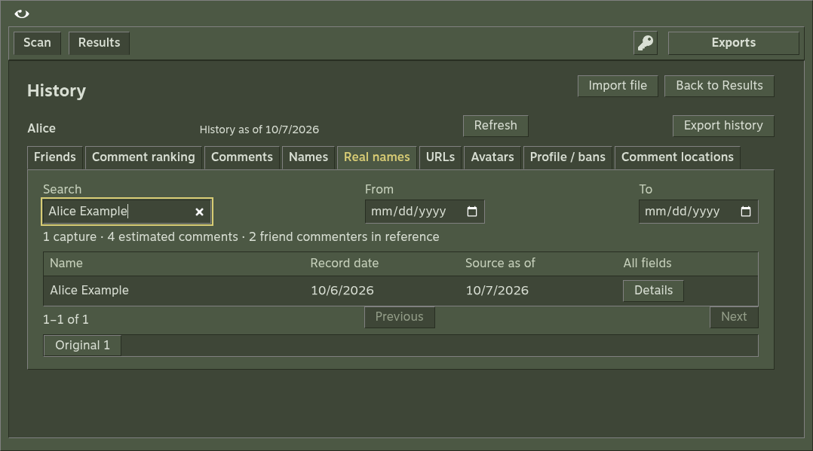
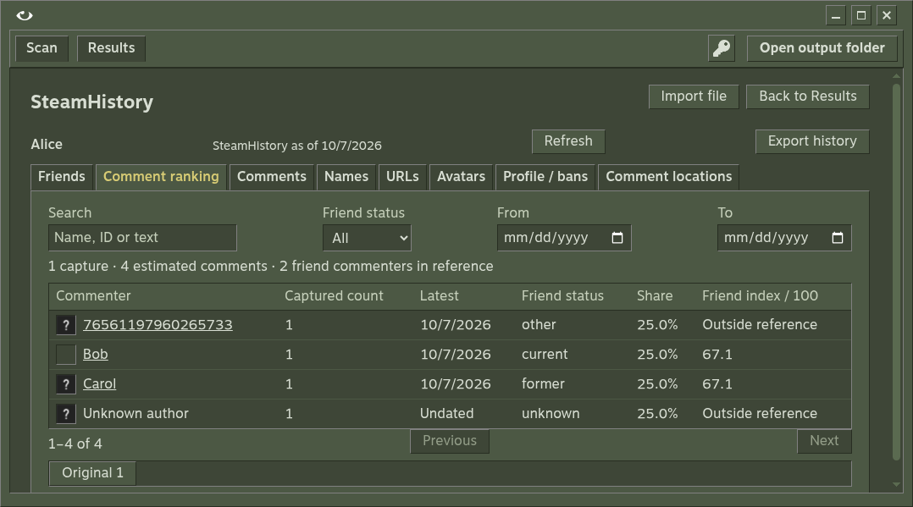
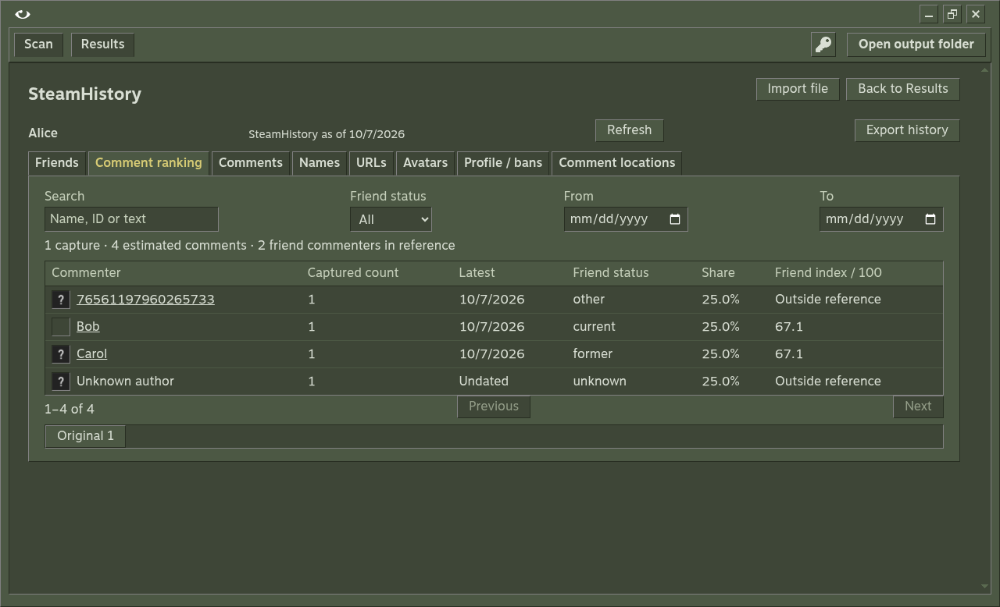

# SteamHistory restoration verification

Checked locally on 2026-10-07 and 2026-10-08 against the working copy based on main `2047f5e`. PR #5 also checks each pushed head. No release or installed app was changed.

## Restored behavior

Account verification and recent-account selection load history separately from Steam collection. Completed results also load matching history. Saved captures are reused; Refresh requests another capture. A blocked request retains saved evidence and offers Retry. Original inputs, all snapshots, comment versions and unknown fields remain available for inspection and export.

The shared browser/desktop viewer covers friendship periods, comment ranking, comments, names, URLs, avatars, profile/ban metadata and separate comment-location evidence. Filters and 100-row paging keep large captures usable. Imports open in a dialog. Current Steam membership uses dated observations; historical membership and open periods retain their own source dates.

The formula contract restores the authored 2:2:1 count index with explicit reference populations, bounded optional overlaps and exact sum/product location support. Products absorb zeros and remain valid beyond floating-point range. Indices describe captured evidence, not relationship or residence probabilities. VAC counts and collection dates survive checkpoints and exports.

## Evidence

| Check | Result |
| --- | --- |
| TypeScript, Oxlint and UI build | Passed |
| Domain/integration suite | All 48 tests passed on the final local rerun, including the 500-account fixture, current pagination, safe comment identity, live-only membership dates and mismatched attachment preservation |
| History browser E2E | Both workflows passed on the final local rerun (22.0 seconds total), including real-name search/details, navigation after imports, partial-warning placement and both Retry buttons updating the selected run, its saved attachment and its download |
| Linux Electron | Passed in the source app under Xvfb; five-account scan, history attachment, membership filter and original metadata inspection; no page errors; clean exit 0 |
| Linux packaged desktop | Passed twice with the frozen helper and bundled browser; paginated fixture history, scan, seven exports, native controls and clean shutdown |
| Native window dimensions | 1078×599, maximized to 1280×778, restored to 1078×599 |
| Live Steam | Authorized Microck profile completed at depth 1 with five collected accounts; all 48 known direct friends retained in ranking, including accounts outside the cap |
| Live SteamHistory | Automatic loading through Vapora succeeded for Microck using the frozen Pydoll helper and bundled Chromium; 52 friendships, 2 avatars, persona/real-name/URL history and 5 comments |

The history browser workflow checks no fetching while typing, account fetch/cache reuse, every viewer tab, membership filters without index drift, date filters, exact original-file downloads, retained cache after blocked refresh, Steam scanning while history is unavailable, automatic attachment, outside-cap inspection and multi-page history navigation. Its providers are fixtures, not proof that SteamHistory accepts this host.

Earlier browser attempts timed out on the memory-constrained host. On 2026-10-08, both workflows passed after the final code changes. Their assertions and timeouts remain unchanged. Fixture cleanup now starts before browser acquisition, so failed launches do not leave local servers running. The native Linux packaged executable passed under Xvfb with its history browser/helper outside ASAR, current paginated fixture loading, five-account scan, seven exports, maximize/restore and clean exit. Closing the server during helper startup also stopped its session and removed the temporary browser profile.

## Inspected screenshots

These captures show fresh fixture accounts, not historical personal datasets. Each image was opened and visually checked. The original olive palette, Motiva Sans, tiny white eye and placeholder assets remain in use.

## Limits and recovery

The current schema requires ranking parameters, nullable observation dates and VAC counts. Earlier local checkpoint/settings/history formats are reported as invalid; files are not migrated or overwritten automatically. Start a fresh run and save current settings. Original SteamHistory source captures can be imported explicitly.

Native Windows/macOS behavior remains unverified locally. PR #5 head `2126d420c530` passed all nine CI checks, including native Linux/macOS packages, the installed Windows app and Windows portable app. An initial portable history wait failed; the next full packaging run passed. One Windows 500-account check encountered a replacement lock and passed its rerun without changing storage code or assertions. CI must verify the final head again. No release was created.

SteamHistory’s current profile response contains account metadata; history is fetched from separate paginated endpoints. Successful raw responses and paths are retained in a reimportable capture, including unknown fields. Microck’s source was last checked on 2026-10-05; retrieval time remains separate. The provider summary reports 8 comments but returns 5. Vapora marks comments partial and preserves the successful sections. Friend-location fields were not supplied by this provider and are not invented.

Building the runtime adds approximately 411 MB before compression on Linux ARM64. Source builds need Python once; packaged downloads include the frozen helper and browser. The default Chromium sandbox stays enabled.

Repeat local checks with `npm run build:history`, `npm run verify` and `VAPORA_BROWSER=/path/to/chrome npm run test:e2e`. Use a host with enough memory for Chromium. The native check also requires Electron, a display server and a window manager.

## Comment-count investigation

On 2026-10-07, the live profile summary returned `totalHistoricCounts.comments = 8`. The public comments endpoint returned five records with `total = 5`. Explicit `commentFilter=all` returned the same five IDs. The deleted filter returned zero rows with total zero; an offset-5 All request returned no rows with total five. All four requests returned HTTP 200. The loaded SteamHistory page changed its comments heading from the initial summary count of eight to five after receiving its records. Vapora did not discard three returned comments.

SteamHistory's [supporter page](https://steamhistory.net/supporter) lists viewing deleted comments as a supporter feature. Its current client code groups deleted comments behind a supporter prompt. This establishes an access restriction, but does not prove the exact three missing records are deleted rather than a stale summary count. That distinction needs authenticated provider evidence. Vapora now explicitly requests the All filter, retains the summary and accessible totals separately, and explains access restrictions and potentially outdated summary counts. The available comments remain usable and exportable.

## Review follow-up

Numeric and string comment IDs now reconcile through the same provider/analyzer helper. Membership selects the newest dated observation and exposes same-date disagreements. Identical imports reuse one source, while distinct captures remain retained. A damaged history file returns an explicit history error alongside a usable scan without replacing the file. The native worker accepts the complete Steam ID range; six boundary cases passed against its actual validation without opening a browser.

The follow-up typecheck and Oxlint passed. Of 46 domain/integration tests, 45 passed and the existing 500-account stress test hit its unchanged 60-second timeout on the resource-constrained host. The previous 45-test run passed in full. CI must verify the final head; these local timeout results are not treated as passing checks.

The last review pass added the Real names tab and recomputation of attached history when ranking controls change. The focused saved-ranking integration check passed, followed by all 46 domain/integration tests and both browser workflows. Fresh browser screenshots above were opened and inspected. CI also stores fixture screenshots as review artifacts.
