# UI audit fixes

This pass fixes eight issues found in the browser UI at main commit
`87d42d1f87d73c5c596bfa8cad94475af8330486`. It keeps the olive Steam styling,
scan settings, analysis formulas, provider behavior and export data unchanged.

| Area | Corrected behavior |
| --- | --- |
| Ranking forms | Short labels stay consistent across both forms: Count scale, Location rule, Location scale and Hub cutoff. All nine fields explain their purpose and the effect of changing their values through in-app help, including Top N and weights. Inputs and selects stay within their columns, share a 32 px height and align below labels. |
| Dialog errors | Save, Load and History import errors appear inside the open dialog and receive focus. Invalid fields expose their state to assistive technology. |
| Tooltip placement | Help stays adjacent to its trigger, choosing the side with the least control overlap and clamping inside the viewport. Save settings help leaves Load settings clickable; profile help leaves Details clickable. |
| Offline actions | Apply says that settings were not saved, explains how to reconnect and retains that message during background polling. Retrying after reconnecting saves the settings. |
| Keyboard help | Evidence, mutual-count, location, ranking and history-count explanations have focusable help buttons. Static help descriptions remain available while the popover is closed. |
| Narrow tab strips | Tabs stay on one line with scroll arrows when needed. Selecting a tab reveals it beside its panel. |
| Comment identities | Comments use names and avatars already present in the history report. Search accepts those names and Steam IDs. No extra identity requests are added. |
| History formatting | Profile dates, booleans, ban states and singular durations use readable text. Original record details and downloads retain their supplied values. |

## Verification

- `npm run verify`: type checks, Oxlint and all 59 tests pass.
- `VAPORA_BROWSER=<chromium executable> npm run test:e2e`: all three browser
  tests pass against real local HTTP fixtures. The added test exercises the
  corrected forms, dialog errors, tooltip hit targets, offline retry, keyboard
  help, narrow tabs and history presentation.
- Manual browser checks: 1078 x 700 and 320 x 740 viewports, plus 200% CSS
  content zoom. The screenshots below were opened and inspected.
- All 18 ranking controls across the two forms were checked for hover,
  keyboard focus, tooltip descriptions, Escape dismissal and viewport bounds.
  Reading help leaves the field values unchanged. A 320 x 100 short-window check
  verifies that long help stays within the viewport and scrolls by mouse wheel
  inside a modal without closing.
- Linux source Electron: ranking and API-key dialogs render; maximize reaches
  1280 x 878, restore returns to 1078 x 599, and the close control exits the app.

These checks use synthetic accounts and local provider fixtures, not a live
Steam scan. CSS content zoom does not certify native browser zoom behavior.
Windows and macOS packaged builds are not covered by the local checks;
the PR's desktop workflow packages and exercises all three platforms, including
the Windows portable download. No screen-reader certification is claimed.

## Before and after

Before images show the main commit above. After images show this change. Each
pair uses the same viewport and action; fixture account state can differ.

| View | Before | After |
| --- | --- | --- |
| Scan ranking dialog |  |  |
| Results ranking form |  |  |
| Narrow ranking dialog |  |  |
| Load error |  |  |
| Save settings tooltip |  |  |
| Offline Apply |  |  |
| Keyboard help |  |  |
| Narrow Results tabs |  |  |
| History comments |  |  |
| History profile |  |  |
| Invalid history import |  |  |

## Ranking help

Each ranking field explains its purpose and the effect of changing its value.
These examples show the hub definition and the all-zero weights behavior.

| Results help | Narrow dialog help |
| --- | --- |
| 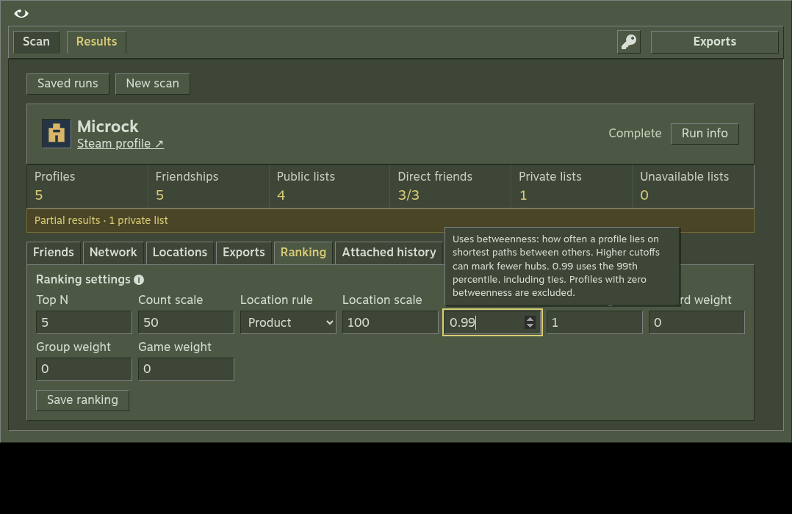 | 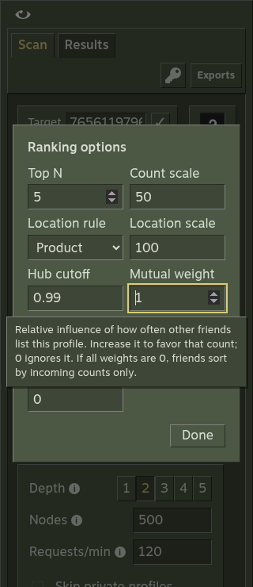 |

## Tooltip and saved-warning follow-up

At main commit `33a1831b47012433ff7d7611ea830b0cee53783f`, the request-rate
tooltip could move to the window's bottom edge to avoid controls. At 1078 x 606,
its top sat 327 px below the help icon. Help now considers only the trigger's
four sides. In the same view it starts 7 px below the icon. Dense forms can have
some overlap; help stays near its control and supports Escape dismissal.

Saved capture diagnostics now use the same neutral History wording as current
messages. Displaying a warning does not change the original capture, coverage
records, account data or downloads. The browser regression imports a capture,
reopens it from disk without provider requests, checks the tooltip and viewer,
and compares its original download byte for byte.

These fixture screenshots were opened and inspected. Both pairs use a
1078 x 606 viewport. The warning pair uses the same saved diagnostic.

| View | Before | After |
| --- | --- | --- |
| Request-rate help | 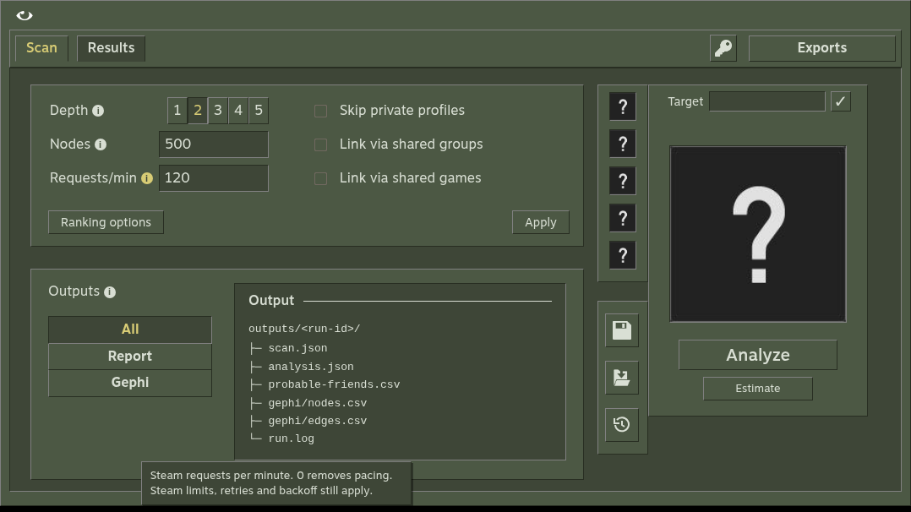 | 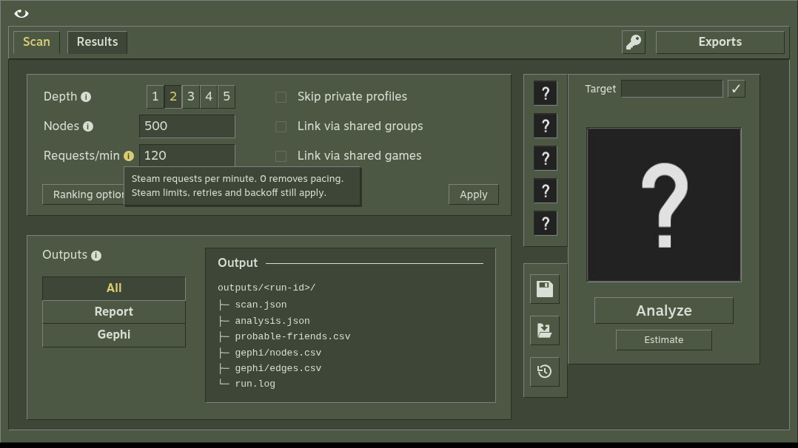 |
| Saved History warning | 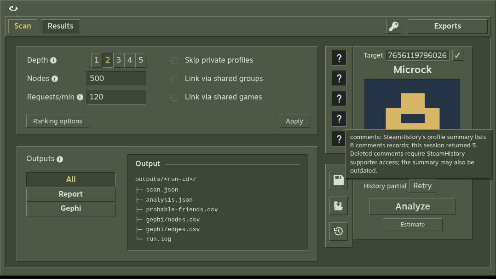 | 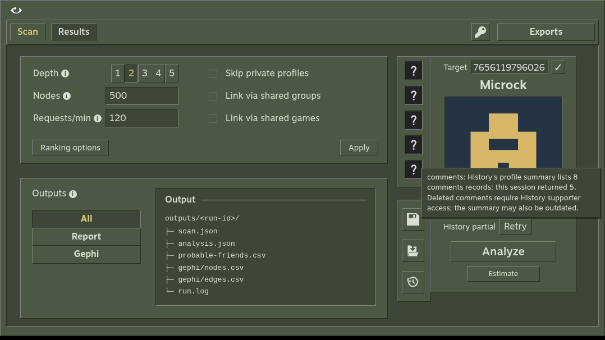 |

## Cancellation and ETA follow-up

Cancelling a run opens its saved results. Network analysis previously ran on
Electron's main thread, blocking both the local server and native window
controls. Graph calculations now run in an owned worker that terminates when
the operation is interrupted. The same analysis formulas produce the report.
Checkpoint-save failures remain visible instead of appearing as successful
cancellations. Cancel immediately shows Saving checkpoint while it finishes.

The progress row shows an approximate ETA after three completed collection
requests. It uses elapsed time, request pacing and known remaining work,
including metadata batches and enabled optional signals. New profiles and
retries can change the estimate. It makes no extra provider requests, resets
on resume and shows Finishing during analysis.

- Linux: types and Oxlint pass; all 60 core tests and three browser workflows
  pass against local HTTP fixtures. Cancellation during analysis retains the
  checkpoint, and resume completes without fetching collected lists again.
- Windows 10 Pro 19045 x64: all 61 core tests pass, including real sharing-lock
  checks. A packaged candidate cancels a held Steam request, keeps native
  controls responsive, resumes to completion and generates its exports.
- On that Windows host, opening the same 2,000-profile cancelled fixture with
  the unmodified 2.2.3 backend blocked a native control response for 1,569 ms.
  The final fixed candidate's longest response was 43 ms, with 72 successful
  control checks during analysis.
- The Windows candidate uses the released Electron and history resources with
  a rebuilt application ASAR. The public release files remain unchanged.
- The code simplification review ran inline across reuse, quality and
  efficiency. Progress counts share one profile pass; no new dependencies,
  compatibility paths or unreachable elements were introduced.

These ETA screenshots were opened and inspected at 1078 x 599 and 390 x 844.
The narrow view has no page-level horizontal overflow.

| Desktop progress | Narrow progress |
| --- | --- |
| 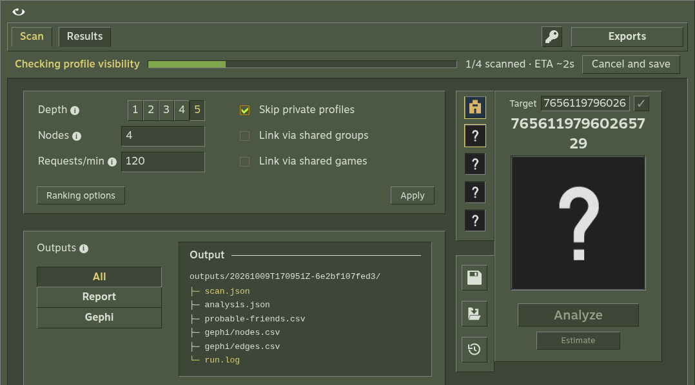 | 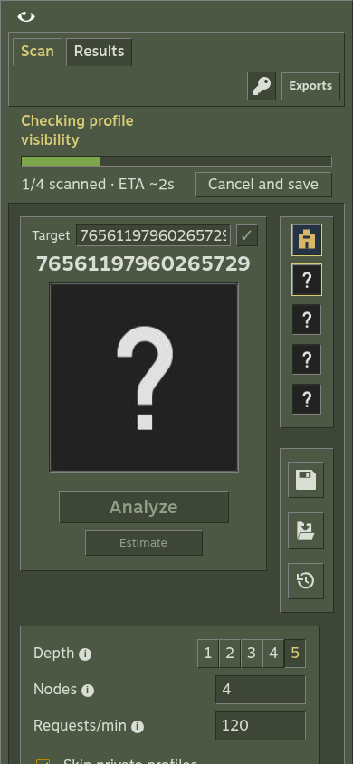 |

## Network explorer follow-up

Network now opens as a compact 240 px preview. Maximize view expands the same
mounted canvas inside Vapora; Restore view or Escape returns to the preview.
Camera, selection, search and filters survive the size change. Both sizes use
the existing olive palette, Motiva Sans, beveled controls and independent Details
windows. Native desktop window controls remain available above the explorer.

Sigma renders every observed connection. ForceAtlas2 arranges profiles using
friendship edges in a bundled worker, with a bounded 300-iteration run. Pause,
node dragging, navigation and hidden pages stop layout work. Dragging pins a node;
Pin/Unpin also works from its selection summary. Layout errors and unavailable
graphics produce visible guidance instead of silently changing renderers.

The expanded view offers community, collection-status, minimum-degree and
one/two-hop filters, node sizing, label controls and a paginated profile list.
Search remains available in the preview. Selection highlights neighbours without
removing unrelated connections. Counts distinguish filtered data from the whole
network. Save image exports the rendered view as a PNG; completed runs link to
the existing Gephi CSV exports. Exploration does not edit checkpoints or fetch
new Steam observations.

Browser coverage uses a synthetic 200-profile graph with 2,000 connections to
check that the old 1,500-link cap is gone. It exercises layout settling and
pause/restart, keyboard search, profile windows, node dragging/pinning, filtered
counts, empty filters, pagination, image export, in-app expansion and narrow
windows. Background controls leave the tab order while expanded; restoring
returns them. Details, help and native controls stay usable. Graph calculations
and collection behavior keep their separate domain and integration coverage.

A Windows 10 candidate built with the released Electron runtime was also checked
against a private copy of the supplied saved run: 1,817 profiles, 3,926 friendship
links and 16 communities. Its native controls, in-app expansion, selection,
neighbour filtering, dragging/pinning and Details worked without renderer errors. This
checks a local candidate, not a newly published portable executable. The original
run and installed app were not replaced.

Verification passed: TypeScript, Oxlint, all 60 core tests and all five browser
workflows. The final outside-admission Details check also passed after its guard
was added. The Windows candidate check used the final application bundle;
the isolated task and app directory were removed after testing. Simplification
ran inline across reuse, quality and efficiency, preserving existing profile
rendering and avoiding repeated sidebar updates during layout frames.

These synthetic screenshots were opened and inspected. The first two retain a
user-selected zoom level, demonstrating that expanding does not reset the view.
Private saved-run files are not included in the repository.

| Preview | Expanded | Narrow expanded |
| --- | --- | --- |
| 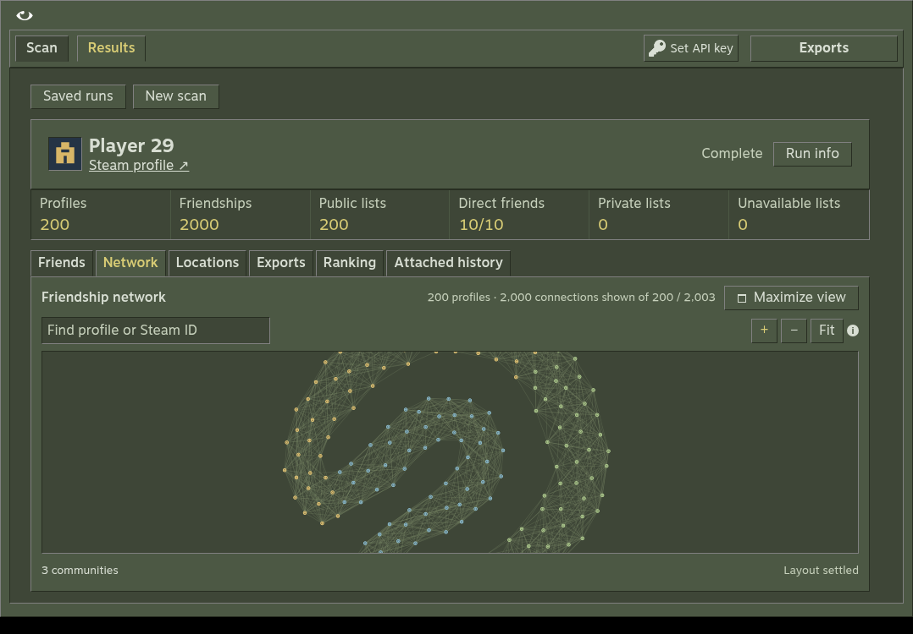 | 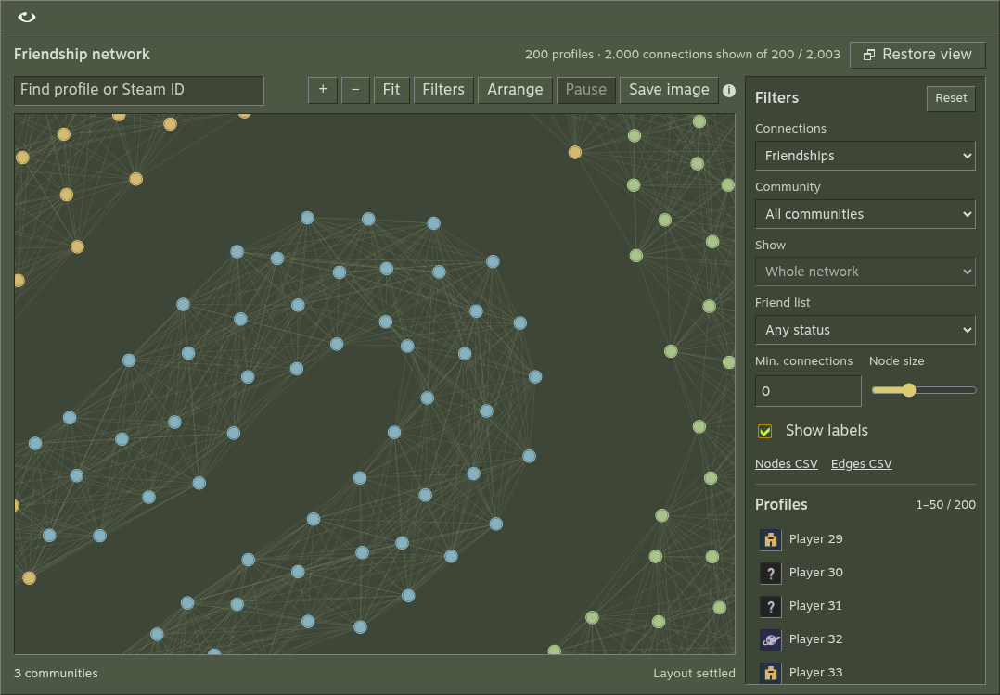 | 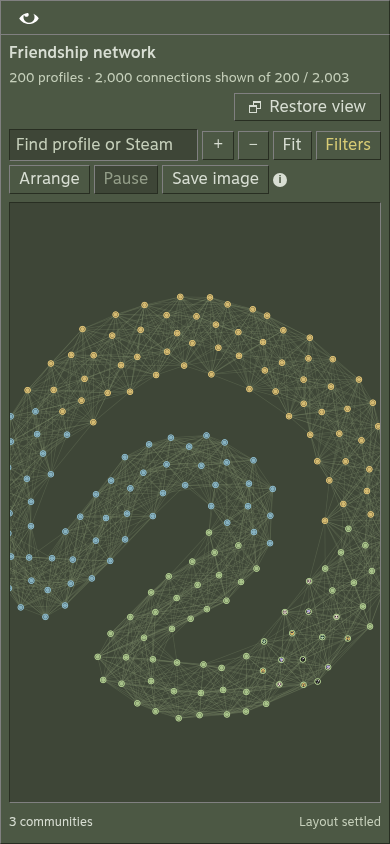 |

## Graph performance and profile pictures

Hover, selection and search now update Sigma's native node/edge state rather
than rebuilding graph indexes. Search changes coalesce per frame; node sizing
does not rebuild the filters or profile list. ForceAtlas2 keeps its working
matrices across all 300 iterations and transfers one packed position buffer
from the worker. Cancelling still terminates the worker immediately.

Saved avatars fill circular nodes, with a thin community-coloured border and a
gold border for selection. Pictures start loading when their displayed radius
reaches 8 px and they intersect the viewport. Collection waits 100 ms after
navigation pauses. Six image validations run concurrently, shared URLs reuse
their result, and stalled requests time out after 15 seconds. Missing or failed
avatars use the existing question-mark image. If that local image also fails,
the community-colour circle remains usable. Image updates batch without graph
indexing; atlas entries use 48 px pictures. Visited pictures stay cached for
that graph's lifetime and release with its renderer; there is no fixed cache
limit across all visited profiles.

The browser workflow reads actual screenshot pixels for an avatar, a broken
avatar and a missing avatar. It also checks dragging/pinning, keyboard profile
selection, filters, pagination, PNG export, expansion/restoration and narrow
windows. The screenshots and exported PNG were opened and inspected. The final
TypeScript and Oxlint checks pass, as do all 60 core tests and all five browser
workflows. A final scoped graph run passed after the test's input timing and
pixel-sampling cleanup.

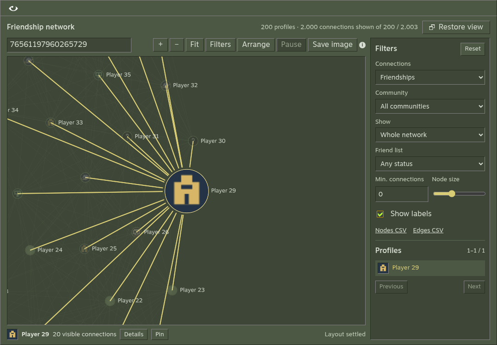

The same private 1,817-profile, 3,926-link saved run was measured before and
after these changes in headless Chromium at 1078 x 750, using SwiftShader
software rendering. Avatar responses used a local image fixture, so these
measurements exclude live CDN latency. Hover targets were warmed first.
Interaction times include the handler and the following two animation frames,
including deferred work, rather than measuring the input handler alone.

| Saved-run measurement | Before | Final candidate |
| --- | ---: | ---: |
| Open explorer to settled layout | 23.9 s | 7.2 s |
| Median hover interaction, 15 samples | 901 ms | 372 ms |
| Median search interaction, 10 samples | 1,417 ms | 591 ms |
| Median node-size interaction, 10 samples | 1,252 ms | 665 ms |
| Graph indexing passes during hover / search / sizing | 15 / 20 / 20 | 0 / 0 / 0 |
| Additional renders during one unchanged idle second | 0 | 0 |

These are diagnostic measurements on a shared software-rendered test host,
not native Windows FPS or latency promises. A separate final 2,000-profile,
10,000-link fixture retained every link and produced no page errors, graph
indexing passes during the sampled interactions, or idle renders. Its five
samples per action still showed slow software-rendered frames: median hover
884 ms and median search 1,542 ms. An earlier 60,000-link baseline exceeded the
180-second browser-protocol limit; this pass does not certify that scale.
The full-length final dense benchmark was interrupted, so its partial output
is not counted as a completed benchmark.

Sigma 4.0.0 publishes an optional-style declaration that resolves to `never`
under strict null checking. The install script corrects that declaration only,
without changing Sigma runtime code or weakening application types. It checks
the expected declaration and is idempotent. Remove the script and postinstall
entry when the pinned Sigma release contains the upstream correction.

The simplification review ran independently across reuse, quality and
efficiency. Four fixes were applied: batch avatar updates, avoid discovery on
unrelated renders, cancel timed-out requests, and compare filters directly.
No scan observations, analysis formulas or export schemas changed in this pass.

An intermediate optimized Windows 10 candidate passed native dragging/pinning,
filtering, Details and both maximize/restore controls against the supplied run.
The final candidate's packaged UI matched the verified browser bundle byte for
byte. Its native avatar recheck did not complete: the isolated window became
hidden after navigation and animation-frame waits stalled. A fresh temporary
profile and disabled background throttling did not establish a completed final
native check. No cause was proved and no desktop-launcher change was made.
The intermediate native pass does not certify the final circular-avatar layer
on Windows. The temporary app, task and port forward were removed; the original
app and run were retained.

### Final release review: history ownership and Windows checkpoint reads

CI exposed a startup race: reopening a saved run could start an automatic history load after the user had already looked up an account, replacing the newer viewer and its original-download buttons. Saved-run loading now checks both the history request version and navigation version before loading account history. The original-download test retains its pointer click and exact-byte assertion.

Windows CI also reproduced an `EPERM` replacing `scan.json` while saved-run polling read it repeatedly. The storage layer now queues checkpoint and artifact IO with an Effect semaphore, keeping JSON decoding outside the permit. External locks still have the existing bounded retry and truthful failure. The real Windows 10 sharing-lock, permanent-error and 500-account concurrent-read tests all passed. The shared queue can hold unrelated run-file IO behind an external replacement retry for up to 1.55 seconds; no unbounded per-file lock cache was added.
