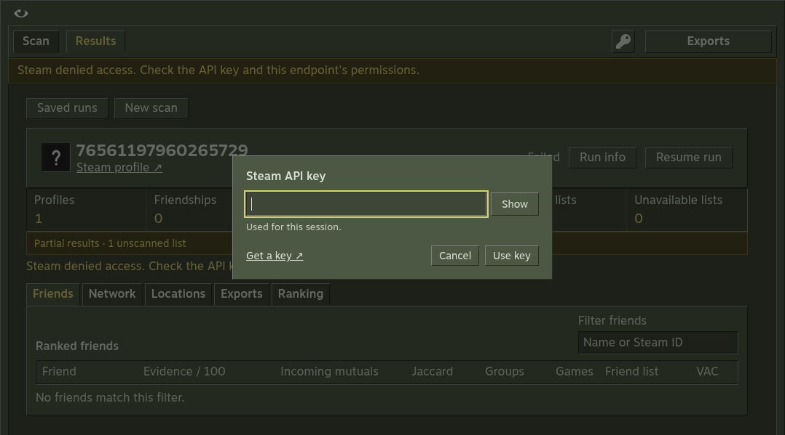

# Vapora 2.1.0 verification

Checked on 2026-10-07 against the shared browser and Electron UI. This records the current release candidate, separately from the [earlier live Steam and source-launch checks](e2e-verification.md).

## Local checks

| Check | Evidence | Result |
| --- | --- | --- |
| Core | `npm run verify`, real HTTP/filesystem fixtures | Types, Oxlint, build and 20 domain/integration tests passed, including 500-account collection and filesystem failures |
| Browser | Chromium at 1078px and 320px | Key validation/continuation, zero limits, persistence, cancellation/resume, history, downloads, tooltip interactions and viewport bounds passed; no page errors |
| Recent targets | Actual avatar-rail clicks | Target name/avatar selected immediately, settings retained, Scan stays visible, no report or Steam requests |
| Estimates | Scanner-generated depth-5 estimate | Aligned facts, depth-specific sampling caveat through in-app help, narrow layout fits |
| Exports | Rebuild after replacing an export with stale content | Current report restored without provider calls, checkpoint bytes unchanged, attached history preserved; incomplete/busy runs and real filesystem failures rejected |
| Network | Hidden graph, open/close tabs, zoom/reset | No graph nodes until Network opens, DOM retained across unchanged tab switches, zoom resets correctly |
| Packaged Linux ARM64 | Actual bundled executable, native window manager | Fixture scan/downloads, isolated renderer, maximize/restore and clean shutdown passed |
| Remembered key | Isolated real GNOME Secret Service and private D-Bus session | OS-encrypted bytes exclude plaintext key; reopening without an environment key works; forgetting removes the file and keeps the current session working; following restart has no key |
| Insecure storage | Actual Electron `basic_text` backend | Remember option disabled with a visible explanation; no key file created |
| Live Steam | Microck profile, depth 1, five-account cap | Five profiles with names, avatars and ban responses; 48 direct friends reported, cap marked as partial, populated exports and no API key in saved files |

Public screenshots use fixture names and avatars. Captures were opened and inspected after the final changes. Tests use a fixture key and temporary storage, including a separate OS keyring. Original user data, the local `.env`, and the daily-driver keyring were not touched.

## Captures

[320px estimate](screenshots/estimate-narrow.png) · [Native maximized window](screenshots/window-maximized.png)

## Native release checks

The Desktop packages workflow runs on Linux, Windows and macOS for this PR and the final main/tag commits. It tests the actual Windows installer and portable EXE, extracted Linux AppImage and mounted macOS DMG. The packaged suite checks secure-key persistence/forgetting when the OS backend is available and checks disabled remembering otherwise. Portable verification moves the EXE and saved data together and reopens the report without collecting Steam data again.

CI and reviewer results must be green on the exact release commit before publishing. The [release runbook](release-runbook.md) records artifact and public-download verification. Local ARM64 Linux checks alone do not establish Windows DPAPI or macOS Keychain behavior.

## Limits

The live check covers a five-account scan. Large live networks remain untested. Remembered credentials are bound to their OS account and machine. Browser keys stay session-only.

Export files are atomically replaced individually, rather than as a multi-file transaction. A visible storage failure can leave a mixture of earlier and rebuilt exports; resolve the filesystem error and rebuild again. Incomplete runs must finish or resume before rebuilding exports.

The simplification review ran inline under the no-delegation instruction, using the skill's reuse, quality and efficiency rubrics. It reused the existing checkbox style and simplified one boolean expression. No unused elements, compatibility adapters or new dependencies were introduced.
